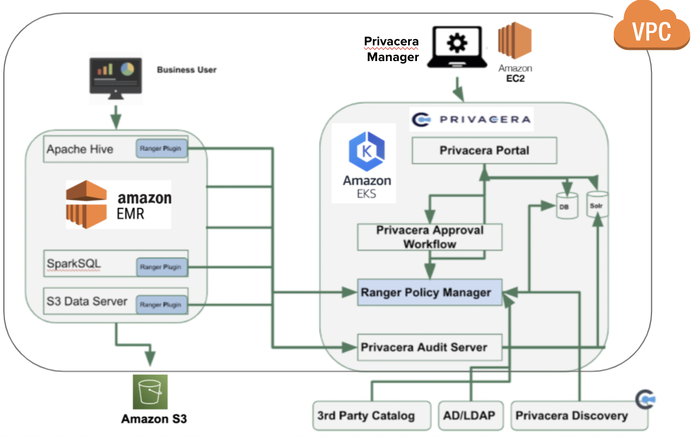
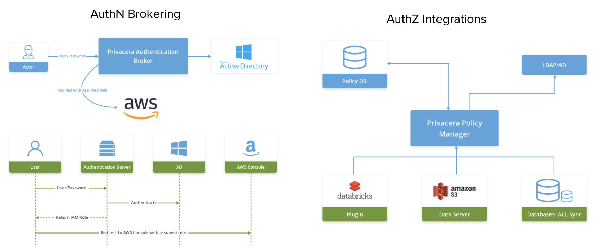

# Privacera (on EKS) Integration with Kerberized EMR (using EMRFS)

## Pre-requisites
 - IAM Account w/ Admin Access
 - Command Line utils - aws, kubectl, helm, eksctl, k9s

## Steps

1. Create new security credentials for your IAM Role

2. Create SSH key pair

3. Swith to AWS Profile 
    ```
    $ aws configure --profile art-privacera-demo-iam
    $ export AWS_PROFILE=art-privacera-demo-iam
    $ aws sts get-caller-identity
    ```

4. Spin up EKS Cluster
    ```
    $ cd eks
    $ ./create-eks-cluster.sh
    $ cd ..
    ```

5. Setup Privacera Manager and Install Core Services
    ```
    $ cd privacera-manager
    $ ./setup-privacera-manager-install.sh
    ```

    Update files under `~/privacera/privacera-manager/config/custom-vars` with `confg/custom-vars`


6. Deploy EMR and Setup
    ```
    $ cd emr
    $ ./create-emr-cluster.sh
    $ ./submit-add-user-step-to-emr.sh
    ```

## Architecture

### Privacera (on EKS) with EMR


### Privacera Security Integration and Flows


